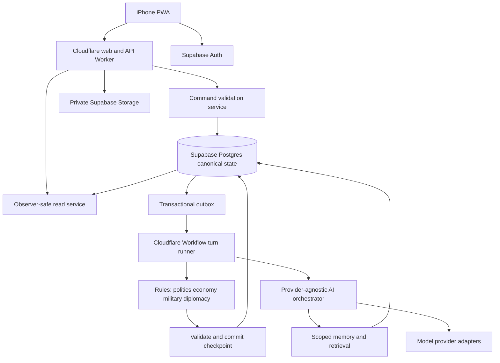
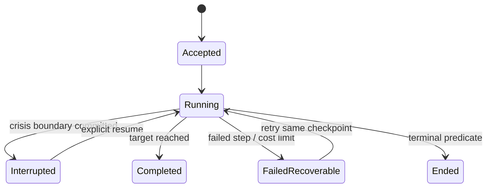

# IMPERIUM — Proposed Architecture

Status: planning architecture updated with accepted Q01–Q18 decisions; companion to [BUILD_SPEC.md](BUILD_SPEC.md). Product authority remains IMPERIUM_REQUIREMENTS_v0.3.md. Accepted review decisions and remaining engineering follow-through are recorded in [UNRESOLVED_QUESTIONS.md](UNRESOLVED_QUESTIONS.md).

## 1. Deployment and trust boundaries

Use a TypeScript modular monolith with independently deployable web/API and durable turn runner. Keep domain services as code modules initially; do not introduce a distributed database per simulation subsystem.



Recommended frontend is React/TypeScript with Next-compatible routing, Tailwind or equivalent, a service worker and MapLibre. Keep frontend rendering separate from simulation execution. The exact Cloudflare adapter is an integration gate: current Cloudflare documentation recommends vinext for Next.js applications; confirm required routing, authentication and PWA compatibility before pinning versions. This is a deployment choice, not a change to gameplay. [Cloudflare Next.js guidance](https://developers.cloudflare.com/workers/framework-guides/web-apps/nextjs/).

Use Cloudflare Workflows for durable multi-step jobs with retries. Split computation into bounded steps and store large artifacts in Postgres/storage, not workflow payloads. This does not provide exactly-once game effects by itself: application idempotency and transactional fencing remain mandatory. [Cloudflare Workflows](https://developers.cloudflare.com/workflows/).

Supabase owns Postgres, Auth, pgvector and proposed initial private asset storage. Cloudflare R2 remains an alternative for large exports/assets if measured need warrants it; avoid dual asset authorities initially. GitHub stores source, migrations, fixtures and deployment configuration. None of these resources is created during this planning task.

Proposed repository layout:

```text
apps/web/                   mobile screens, service worker, design system
apps/api/                   auth, read projections, command endpoints
apps/turn-runner/           durable workflow entry and step orchestration
packages/contracts/        versioned JSON schemas, DTOs, command types
packages/domain/           invariants, units, calendar, authority rules
packages/simulation/       reducers, timeline, economics/politics/military/diplomacy
packages/ai/               adapters, routing, role prompts, proposal validation
packages/memory/           scope filters, graph traversal, search, summaries
packages/data/             repository queries and transaction interfaces
supabase/migrations/       ordered reviewed database migrations
fixtures/                  synthetic scenarios and provider recordings
tests/                     integration, scenario, property, security and PWA tests
```

## 2. State and temporal model

Postgres current tables are materialized authoritative state at a committed campaign revision. An immutable change/event log plus periodic snapshots allows inspection and reconstruction. This is not a requirement to rebuild the whole world from prose or run all reads through pure event sourcing.

Every authoritative mutation records campaign, revision, simulated effective time, real recorded time, ruleset version, command, outcome and causal provenance. Separate `sim_time` from `recorded_at`; maintenance and API retries never advance `sim_time`. Exact numerical fields carry units and definitions. Derived totals specify their source query and are not independently writable.

Simulation inputs can use intentionally uncertain or approximate baseline estimates, but accepted values become explicit campaign assumptions. Unknown hard stock cannot be spent. The campaign creator can supply or approve a generated number with provenance. Distinguish uncertain world initialization from in-game fog of war.

Corrections need effective time and recording time because a fact can be entered today but apply since campaign start. Retain superseded assertions and causal edges, mark derived summaries stale, and prevent mixing a corrected state with an incompatible projection. Accepted Q01 preserves resolved historical outcomes without replay. A correction preview identifies affected facts, current projections and summaries; application appends historically effective assertions while retaining original events/decisions and clearly labeling historical inconsistencies caused by the correction. Future simulation uses corrected facts. Branch replay is not included.

## 3. Turn execution and recovery

State machine:



Briefing status is orthogonal: pending, ready or failed. A narration failure does not rewind a committed turn. The UI can show a structured briefing pending prose. FailedRecoverable retains last committed time and requested target. Terminal campaigns permit history inspection; accepted Q11 allows only campaign-configured continuation.

### Acceptance and concurrency

Accepted Q02 separates the fixed-time player decision phase from the end-turn advance job. Meetings, negotiations and discussion update dialogue, commitments and validated immediate interaction state at the same simulated timestamp. They never charge elapsed time or meeting action points. Production, travel and other time-dependent consequences execute only during the requested advance. Repeated identical arguments or queries do not reroll beliefs/intelligence or stack free support; substantive new information or concessions may change a response. API processing latency is real waiting time, not simulated time.

The API verifies ownership, revision, no conflicting active advance/edit and target validity. One transaction records the turn, command idempotency key and outbox dispatch. A dispatcher retries undelivered outbox rows; the workflow ID is stable per turn. A campaign lock/version check and fencing token at each database commit prevent stale runners from committing. Only one accepted active timeline exists per campaign, even with multiple devices. No database transaction remains open while calling an AI provider.

Starting a turn authorizes background completion of that requested interval when the browser closes. A periodic dispatcher may restart an already-authorized job, but cannot create a new advance request. Emergency interruption requires a new explicit resume, not a wall-clock timer.

### Chronological interval algorithm

1. Load the last checkpoint, revision, ruleset, persisted random draws, unresolved directives, operations, political processes, event schedule and actor-planning schedule.
2. Select the next boundary: nearest scheduled event, required model integration step, action completion, deadline or requested target. Calendar months are not assumed to mean 30 days. Accepted Q05 uses event-driven sub-day timestamps with bounded subsystem integration steps.
3. Integrate continuous quantities only through this boundary: population/economy, finance, projects, production, inventories, logistics and readiness. Solve coupled inputs/outputs from one coherent interval state; do not produce goods using resources that have not yet arrived.
4. Apply due events and update domestic politics, public sentiment and diplomacy. Evaluate authorities, expiry/ratification, elections and institutional processes. Event precedence and tie-breaking are versioned rules; arbitrary actor iteration order must not decide a conflict.
5. Evaluate actor objectives and strategies using each actor's beliefs. Scheduled actor review occurs even without a player action. Construct candidate actions from the same snapshot, then resolve interactions, competition and resource conflicts together. Persist chosen/rejected proposals before continuing.
6. Evaluate dependent and due Strategic Threads using actual canonical exposure and actor-perceived exposure separately. Validate mitigations, amplifiers, capacity and dates. Feed relevant options into actor resolution without forcing a plot event.
7. Resolve military operations and stochastic events with versioned rules and persisted random draws. Discoveries of an event inside the interval cause subdivision and recalculation to that instant before committing; never integrate beyond an emergency then simply change the displayed date.
8. Build candidate true deltas. Run collection/dissemination and observer belief updates. Evaluate interrupt eligibility under Q03 and terminal conditions. If a terminal event occurs earlier, truncate at its boundary too.
9. Validate all deltas, quantities, authority, cross-campaign references, conditions and causal links. Atomically commit true state, knowledge projections, events, decision outcomes, thread evaluations, ledger entries, checkpoint, campaign time/revision and outbox work.
10. If interrupted or terminal, stop. Otherwise continue until the requested target. Briefings use only the committed player projection. Summaries/embeddings can be generated asynchronously; missing derivatives never invalidate raw history.

Each step has a unique `(campaign, turn, checkpoint, stage, input_hash)`. Retries reuse persisted accepted AI output and random values. If a provider timed out before its output was stored, a repeat request may differ; that is acceptable only before any corresponding outcome committed. Replay of committed history uses recorded proposals and draws, not new model sampling. Rules/model changes are versioned and take effect at an explicit future boundary.

Crash tests must cover commit-before-ack, dispatch-before-mark-delivered, provider timeout, partial summary generation, old runner restart, browser closure and double resume. An atomic Postgres checkpoint is the visibility boundary; clients never receive a half-updated budget and inventory.

## 4. Rules and quantitative simulation

Use pure domain reducers accepting typed state and actions and returning deltas/events; persistence and model APIs sit outside reducers. Fixed-point/decimal arithmetic applies to money and resources, integer counts to indivisible equipment and people. Unit conversions are versioned. Negative availability, contradictory location, cyclic command hierarchy and unauthorized expenditure fail validation.

Inventory balances reconcile opening + production + receipts − consumption − losses − transfers out. Reservations prevent competing plans spending the same stock; release unused reservations when plans expire. Production consumes inputs and capacity over time and creates output only on completion. Ships/airframes can be individually identified while ammunition uses fungible stock. Transfer ownership never creates a second item. Personnel stocks reconcile recruitment, transfers, casualties, recovery and separation; casualty categories cannot double-count deaths.

Finance distinguishes appropriation, commitment and actual cash payment. Cash change equals revenue plus financing minus expenditures and debt service, with debt principal tracked separately from interest. GDP is an economic measure, not treasury cash. Deficit definitions and real/nominal values must be consistent. Trade routes, energy inputs, industrial throughput and resource processing capacities constrain economic and military outputs. The macro/sector approach is accepted under Q09; coefficients must be documented and calibrated during engineering; AI cannot invent GDP deltas to fit desired drama.

Politics uses quantitative support and institutional state plus AI-proposed behavior. A proposed support model combines prior support, experienced outcomes, policy alignment, faction ties, leadership credibility, war fatigue and bounded shocks; coefficients and temporal decay are reviewable ruleset data, not universal claims about real politics. Actors choose bargaining and votes based on private priorities and beliefs. Actual votes are resolved once at the legal boundary; intelligence forecasts can be wrong. Seat arithmetic, quorum and vote thresholds are deterministic. Elections and unrest use explicit prerequisites, support distributions and stochastic resolution; neither automatically targets the player for drama.

Military resolution aggregates at operational formations using terrain/access, force composition, readiness/training/morale, supply, doctrine, command and belief quality. Persist losses and expenditure through ledgers. Units travel through plausible routes and time; teleportation is invalid. Home station differs from actual and assessed disposition. Nuclear capability includes warheads, delivery assets, command/control, doctrine, survivability and second-strike capability; validation checks campaign release procedure independently of commander recommendations. Aggregate operational resolution with detailed organization/inventory is accepted under Q08. Battle duration and casualty coefficients remain engineering calibration tasks.

## 5. AI orchestration

Accepted Q04 requires generally accurate player-facing dossiers, including candidate selection, because the interface lacks many real interpersonal cues. Generate assessments through the observer's legitimate knowledge and encounter evidence; do not pass true trait values to a normal conversation model. Preserve evidence/confidence and plausible deception without injecting arbitrary unreliability. Qualitative evaluations must check that dossiers are practically dependable, not merely that their confidence field exists. Observable demeanor may be described when supported by an encounter. Explicit God Mode remains the separate truth-access surface.

Accepted Q07 models important people individually and remaining political seats through blocs. Resolve bloc votes as counted outcomes (which can split), not necessarily a unanimous single vote. An individually represented member's seat is removed from the bloc's residual count. Promotion from a bloc to an individual preserves memberships, positions, known history and seat totals.

Accepted Q06 adds persisted actor simulation tiers. Background actors keep canonical aggregate capabilities, relationships and causal dependencies with lightweight scheduled evolution; major/relevant actors receive detailed planning. Relevance triggers include indirect supply-chain exposure and events as well as direct contact. Promotion may elaborate unspecified detail consistently with existing totals and provenance, but cannot create stock, rewrite an earlier event or retroactively execute a hidden successful operation. Minor actors remain eligible for background world events. Country names are not hard-coded into importance tiers.

`AIProvider` exposes `generate`, `generateStructured`, `reason`, and `embed`, plus capability metadata, model identity, usage, timeout, cancellation and error normalization. `reason` returns a decision/proposal and concise evidence-based rationale, not a dependency on provider-private chain of thought. Provider adapters implement structured-output validation even when native schema enforcement is unavailable.

Route by task class rather than hard-coded model names: low-cost for summaries/labels/routine rewriting; mid-tier for council/diplomacy/intelligence interpretation; high-reasoning for strategic planning, major crises, military planning and causal evaluation. Profiles specify model, capabilities, maximum context/output, retry/fallback and budget. Changing provider must not change domain schemas. Embedding model changes require separate indexes and re-embedding, not mixed-distance search.

Each call receives an immutable context manifest: campaign, revision, simulated date, principal, purpose, authorized evidence IDs, prompt/schema/rules versions and token budget. Response processing is parse → schema → reference/scope → authority → quantitative feasibility → conflict checks → accepted proposal. AI has no database write tool and no arbitrary code/SQL execution.

Prompt contracts:

| Role | Mandatory context / output constraint |
|---|---|
| Setup assistant | Draft assumptions and field definitions; return field proposals, provenance and unresolved questions; never pretend sourced facts were verified |
| Actor planner | Actor-private objectives, beliefs, capabilities and political constraints; choose valid action/no action/revise or abandon plan; no omniscient enemy data |
| Council member | Biography, doctrine, incentives, relationships and authorized knowledge; return advice, uncertainty and evidence; advice does not execute orders |
| Intelligence analyst | Collection reports and observer beliefs; distinguish assessment/fact, alternatives and confidence; no true-state answer key |
| Rules adjudication assistant | Bounded options and known rule inputs; propose interpretation for validator, not new inventories or arbitrary rules |
| Briefing writer | Player-safe committed facts only; cite fact IDs, preserve quantities/units and uncertainty; never invent hidden causes |
| Summarizer | Principal-scoped sources with dates; retain source IDs and unresolved contradictions; never overwrite originals |

Narrative consistency is not solved by trusting another model to say “looks correct.” Generate structured factual claims first; bind critical numerical statements to projection fact IDs and template authoritative quantities where possible. Validate claim references and observer scope, then check prose for unsupported assertions. Repair/regenerate contradictions; after bounded failures present a factual structured fallback. No guarantee of perfect arbitrary-prose checking is assumed.

Cost accounting records tokens, provider and estimated/actual charges per job/campaign. Bound retries and concurrent planning. If budget is exhausted, pause the unresolved step; never drop actors or causal checks silently. Actor scheduling can use salience and due dates, but major actors retain independent cadence and dormant conditions remain indexed. Accepted Q06 uses lightweight background evolution for minor actors until they become relevant. Promote them on diplomatic, military, trade, event or causal-dependency relevance while preserving canonical state and history. No expensive per-turn planning is required for every minor actor; major actors retain independent planning. Numerical cost/latency targets require measurement, not reopening this decision.

## 6. Seven-layer memory and retrieval

| Layer | Authority and purpose |
|---|---|
| Canonical state | Exact current quantities, relationships, rules and objectives; observer-filtered as appropriate |
| Recent context | Bounded recent messages for the current participant and topic |
| Topic summaries | Versioned, source-linked summaries with observer scope and coverage dates |
| Event archive | Immutable events and observer-safe historical observations |
| Decision/consequence graph | Explicit factual dependencies and separately labeled hypotheses |
| Semantic retrieval | Embeddings/full-text indexes over authorized source chunks |
| Character memory | What a specific character learned, from whom, when, with confidence and recall metadata |

Retrieval procedure:

1. Establish principal server-side: player-government, specific actor/character, or explicitly authorized God Mode. Campaign ownership does not confer normal omniscience.
2. Resolve entities/topics and read exact current authorized state at one revision.
3. Fetch pending orders, due strategies and threads whose typed dependencies intersect those entities/resources, including dormant threads. This stage is deterministic, not embedding-ranked.
4. Traverse relevant causal ancestors, effects, mitigations and amplifiers with a bounded traversal and expandable source links. Distinguish hidden graph edges from player-known explanations.
5. Add scoped summaries, recent dialogue and character memories; run campaign/principal-filtered full-text/vector search for remaining gaps.
6. Rank by causal relevance, topic, authority, temporal relevance and confidence; deduplicate and fit a configurable budget. Mandatory exact facts/constraints have priority. If they exceed budget, partition the task or stop with explicit insufficient context, not silent omission.
7. Save manifest and evidence citations for auditing and reuse. Never use full-history fallback.

The official pgvector extension supplies vector storage and similarity search; the isolation, ranking and causal traversal above are application design. [Supabase pgvector](https://supabase.com/docs/guides/database/extensions/pgvector).

Indexes must filter access before returning candidates, and fill results when approximate vector filtering yields too few authorized hits. Truth chunks and player summaries are separate documents. Never embed a mixed secret/public document and try to redact it after retrieval. Summary regeneration after correction invalidates stale derivatives while raw authorized sources remain searchable.

Threads use a typed predicate AST, for example `all(gte(resource.demand, threshold), gt(exposure.supplierShare, threshold))`, with numeric fields and dependency IDs. Predicates cannot execute code or SQL. Store rule version, conditions, current measurements, eligibility and evaluations. The causal graph contains typed edges such as caused, enabled, constrained, mitigated, amplified, motivated and prevented. Cycles are possible across time, but an edge may not make a future outcome the cause of an earlier fact; chronological event nodes disentangle feedback loops.

For the lithium scenario, exact demand/import/processing capacity queries and thread dependencies find the original energy policy and subsequent Australian/refining mitigation even if they are years old. Actor planning sees its own assessment of the exposure; the adjudicator validates actual exposure. Abandonment is recorded privately and becomes visible only through authorized intelligence. The acceptance fixture supplies intelligence sufficient for the actor to recognize mitigation; it does not grant every adversary omniscience.

## 7. Security and isolation

Use private database schemas for true state and engine internals; normal clients have no table grants or RPC paths into them. Supabase Auth identifies users. API middleware verifies tokens/session and membership; read services return explicit observer DTOs. SQL privileges and row-level security are defense in depth, not a substitute for observer separation. Views/functions require explicit privilege review; privileged routines have fixed search paths and minimal execution grants. [Supabase row-level security](https://supabase.com/docs/guides/database/postgres/row-level-security), [securing the Data API](https://supabase.com/docs/guides/api/securing-your-api).

Prefer a restricted server database role for commit operations; never expose service credentials in the browser. All relationships use composite campaign references. Isolation also covers vector search, object paths, signed URLs, caches, summaries, jobs, observability and error messages. Normal player caches contain no God Mode data. An explicit mode token cannot authorize ordinary endpoints to return hidden fields accidentally.

Recommended auth flow uses same-origin server-managed secure sessions backed by Supabase Auth; protect cookie-authenticated writes against CSRF, validate origin, rotate sessions and clear cached account/campaign data on logout. Verify iPhone reopen/refresh behavior during implementation. If client token storage is chosen instead, record the tradeoff and test XSS exposure explicitly.

Accepted Q13 is personal/private first deployment using configurable server credentials; BYOK/public billing is not initial scope. Provider keys and database credentials live only in server secrets. Validate upload MIME/size/content, quarantine imported instructions as untrusted data, keep private buckets and expiring scoped URLs. Imported Markdown, dialogue and retrieved documents cannot override system/tool policy. Sanitize rendered Markdown/HTML and map content. Use CSP, rate limits, request caps, audit trails and dependency scanning.

God Mode access is logged including reads; its interface clearly identifies truth exposure. Baseline correction does not implicitly reveal opponents' secrets. Full truth exports, if supported, require explicit God Mode semantics; normal archive exports are knowledge-filtered. System operators can technically access stored truth; the gameplay secrecy boundary does not claim protection against a database administrator.

## 8. Operations and deployment

Separate development/staging/production projects and secrets. Pin runtime compatibility dates and dependencies after a small deploy/auth/DB/workflow proof. Prefer migration-first backward-compatible changes and expand/contract data migrations; running turns remain pinned to rules/schema-compatible runner versions. Prevent an incompatible deployment during an active turn or resume with the old version.

Monitor committed turn duration, checkpoint retries, queue age, AI spend, invariant failures, projection lag and retrieval coverage. User-facing logs omit hidden action labels and payloads. Detailed private traces are access-controlled and retained under a defined policy. Backup Postgres plus private asset manifests, restore into an isolated project and verify revisions/ledger hashes before switching traffic. Accepted Q14 preserves immutable history and scoped exports; numerical recovery objectives and retention targets remain engineering release specifications.

Initial tooling after review: supported Node runtime/package manager, Git, Wrangler, Supabase CLI or migration pipeline and browser testing tools. Docker is optional unless the chosen local Supabase workflow requires it; a remote development database is an alternative. Authenticate provider dashboards/CLI when implementation reaches them. Account setup, installations, SQL execution, API calls to paid models and deployment have not been performed here.
