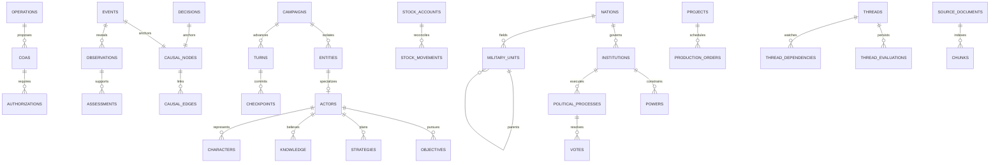

# IMPERIUM — Proposed Supabase Schema and ERD

Status: logical/physical schema proposal for review, not an executed migration. See [BUILD_SPEC.md](BUILD_SPEC.md) and [ARCHITECTURE.md](ARCHITECTURE.md). SQL migration files and executable JSON Schema are deliberately scheduled after review. Accepted Q01, Q05 and Q07–Q10 govern correction history, sub-day timing, political blocs, operational military resolution, macro/sector economics and initial calendar scope.

## 1. Conventions and namespaces

`app`: account/campaign metadata. `sim`: private true state. `intel`: private observer knowledge. `history`: private immutable audit and causal history. `memory`: private scoped retrieval. `jobs`: private execution records. `api`: narrow approved functions/projections, if the Data API is enabled. No default exposure of `sim`, `intel`, `history`, `memory` or `jobs` to anonymous/authenticated clients.

Except global account records, every row below has `campaign_id uuid NOT NULL` and `id uuid NOT NULL`, primary key `(campaign_id,id)`. Every foreign key includes `campaign_id`: shorthand `actor_id -> actors` means `FOREIGN KEY (campaign_id,actor_id) REFERENCES sim.actors(campaign_id,id)`. Never use an ID-only foreign key between campaign tables. All campaign IDs reference `app.campaigns(id)`.

Mutable rows also have `row_version bigint NOT NULL`, `updated_revision bigint NOT NULL`, `recorded_at timestamptz NOT NULL`. Historical facts additionally specify `sim_time timestamptz NOT NULL` and `recorded_revision bigint NOT NULL`; distinguish game date from audit date. Accepted Q05/Q10 uses Gregorian Earth dates and event-driven sub-day timestamps (stored in UTC); alternative calendar adapters are future scope.

Notation: `u`=uuid; `t`=text; `b`=boolean; `i`=integer; `n`=numeric(24,6); `p`=numeric(7,6) constrained 0..1; `ts`=timestamptz; `j`=jsonb; `?`=nullable. Unmarked domain columns are required. `state/status/kind` text fields use enumerated checks or campaign-configurable definition FKs as appropriate. No unbounded arbitrary string is a substitute for a command or rule definition.

Money uses `n` with currency FK; counts use bigint with nonnegative checks; dimensionless indices define a range in their metric definition. Exact arithmetic serializes to decimal strings in APIs. Polymorphic game entities use a registry for referential integrity. JSONB below is for typed documents, configurable rules or descriptive traits; critical count, balance, ownership, foreign key and current status fields are relational columns, never only in a JSON blob.

## 2. Entity relationship overview

This diagram shows principal relationships, not all tables. Catalog tables below are authoritative for proposed details. `CHARACTERS` is an actor subtype with one actor per character; the diagram's simplified representation is not a many-character-per-actor implementation rule.

## 3. Campaign, world and geography

| Table | Domain columns and relationships |
|---|---|
| `app.campaigns` | Global `id u PK`, `owner_user_id u -> auth.users`, `name t`, `status t`, `current_revision bigint`, `sim_time ts`, `start_time ts`, `active_turn_id u?`, `baseline_revision bigint`, `ruleset_version t`; owner index |
| `app.campaign_members` | `user_id u -> auth.users`, `role t`; unique campaign/user. Initially owner-only; does not add multiplayer |
| `app.campaign_settings` | `default_duration j`, `world_type t`, `divergence t`, `technology_era t`, `realism_profile t`, `grounding_enabled b`, `interrupt_threshold i`, `game_over_rule j`, `calendar_profile j`, `player_actor_id u?`, `player_office_id u?`; unique campaign |
| `app.world_drafts` | `draft_version bigint`, `document j`, `schema_version t`, `validation_status t`, `approved_hash t?`; unique campaign active draft |
| `app.draft_field_sources` | `draft_id u`, `field_path t`, `origin t`, `source_id u?`, `confidence p?`, `review_status t`, `assumption_reason t?` |
| `app.validation_findings` | `draft_id u`, `draft_version bigint`, `severity t`, `rule_code t`, `field_path t`, `message t`, `resolution t?`; findings cannot validate a newer draft |
| `sim.entities` | `kind t`, `display_name t`, `created_sim_time ts`, `retired_sim_time ts?`; registry for typed references |
| `sim.actors` | `entity_id u unique`, `actor_kind t`, `home_nation_id u?`, `status t`, `planning_due_at ts`, `profile j`; actor kind covers nations, people, firms, factions, agencies, commands, insurgencies and institutions |
| `sim.nations` | `entity_id u unique`, `actor_id u unique`, `common_name t`, `official_name t`, `capital_region_id u?`, `population bigint`, `identity j`, `flag_asset_id u?`; identity schema includes languages/religions/culture/history/constitutional identity/symbols |
| `sim.regions` | `entity_id u unique`, `parent_region_id u?`, `region_kind t`, `name t`, `geometry j`, `population bigint?`; validated GeoJSON and bounding-box indexes; country/province/state/city or geographic region |
| `sim.region_control` | `region_id u`, `nation_id u`, `control_kind t`, `valid_from ts`, `valid_to ts?`; sovereignty, occupation, claims and administration remain distinct |
| `sim.region_baseline_links` | `region_id u`, `source_id u`, `external_geography_id t`; supports modern-country equivalents without overwriting custom borders |
| `sim.population_groups` | `region_id u`, `classification t`, `label t`, `count bigint`, `share p`; grouping scheme prevents overlapping demographic categories being totaled together |
| `history.baseline_sources` | `source_uri t?`, `source_title t`, `as_of ts`, `retrieved_at ts`, `license t?`, `content_hash t`, `coverage j`, `asset_id u?`; copied campaign provenance |
| `history.baseline_revisions` | `revision_no bigint`, `effective_from ts`, `parent_revision_id u?`, `snapshot_asset_id u`, `manifest_hash t`, `edit_id u?` |
| `app.assets` | `storage_key t unique`, `mime t`, `size_bytes bigint`, `sha256 t`, `purpose t`, `access_policy_id u`, `status t`; paths include campaign UUID |

`regions` represents provinces and cities instead of duplicate province tables. Canonical geopolitical geography is campaign-owned; base map tiles are presentation. PostGIS can replace GeoJSON geometry storage after map/query benchmarking without changing campaign semantics.

## 4. Actors, government and politics

| Table | Domain columns and relationships |
|---|---|
| `sim.characters` | `actor_id u unique`, `birth_date ts?`, `biography j`, `traits j`, `health_status t`, `status t`; biography covers §14 education/career/background; traits schema includes ideology/doctrine/competence/risk/loyalty/ambition/biases/private concerns |
| `sim.actor_objectives` | `actor_id u`, `priority i`, `objective_type t`, `target_entity_id u?`, `desired_condition j`, `red_lines j`, `status t`, `horizon ts?` |
| `sim.actor_strategies` | `actor_id u`, `objective_id u`, `status t`, `plan j`, `next_review_at ts`, `last_evaluation_id u?`; retains rejected/abandoned plans |
| `sim.strategy_evaluations` | `strategy_id u`, `input_revision bigint`, `belief_revision bigint`, `assessment j`, `chosen_action_id u?`, `reason t`, `sim_time ts` |
| `sim.actor_constraints` | `actor_id u`, `constraint_type t`, `condition j`, `source_node_id u?`; fears/red lines/political/economic/capability constraints |
| `sim.relationships` | `from_actor_id u`, `to_actor_id u`, `dimension t`, `value n`, `source_node_id u?`; directional trust, rivalry, influence, loyalty, alliance as typed dimensions |
| `sim.governments` | `nation_id u`, `name t`, `constitution j`, `succession_procedure_id u`, `status t`; one active government per nation unless explicitly modeled otherwise |
| `sim.institutions` | `entity_id u unique`, `actor_id u?`, `government_id u`, `parent_institution_id u?`, `institution_kind t`, `jurisdiction_region_id u?`, `powers_description t` |
| `sim.offices` | `institution_id u`, `title t`, `selection_procedure_id u`, `term_rule j`; office exists independently of holder |
| `sim.office_holders` | `office_id u`, `character_id u`, `valid_from ts`, `valid_to ts?`; non-overlap for single-seat offices |
| `sim.government_powers` | `office_id u`, `action_type t`, `mode t`, `procedure_id u?`, `scope_rule j`, `emergency_rule j?`, `review_rule j?`; all §8 categories represented |
| `sim.procedures` | `institution_id u`, `name t`, `procedure_kind t`, `version i`, `rule_ast j`; quorum, approval stages, veto, ratification, review, elections and succession |
| `sim.political_groups` | `actor_id u unique`, `government_id u`, `parent_group_id u?`, `group_kind t`, `ideology j`, `leader_character_id u?`; parties and nested factions/blocs |
| `sim.group_memberships` | `group_id u`, `actor_id u`, `role t`, `valid_from ts`, `valid_to ts?`; supports coalitions and faction membership |
| `sim.legislative_bodies` | `institution_id u unique`, `seat_count i`, `procedure_id u`; committees can reference parent institutions |
| `sim.legislative_seats` | `body_id u`, `seat_label t`, `holder_character_id u?`, `group_id u?`, `region_id u?`; seat allocations reconcile with body size |
| `sim.political_positions` | `actor_id u`, `issue_entity_id u`, `position n`, `salience n`, `private_intent j`; true position, not dossier |
| `sim.public_opinion` | `nation_id u`, `region_id u?`, `population_group_id u?`, `metric t`, `value n`, `sim_time ts`; public/elite support, fatigue, unrest etc. disambiguated by metric |
| `sim.political_processes` | `procedure_id u`, `procedure_version i`, `subject_entity_id u`, `stage t`, `due_at ts?`, `state j`, `status t`; includes elections, scandals/investigations, succession and legislative processes |
| `sim.legislation` | `entity_id u unique`, `sponsor_actor_id u`, `body_id u`, `title t`, `text t`, `version i`, `process_id u`, `policy_effects j`, `status t` |
| `sim.legislation_amendments` | `legislation_id u`, `proposer_actor_id u`, `proposal j`, `result t`, `decision_id u?` |
| `sim.votes` | `process_id u`, `actor_id u`, `weight n`, `choice t`, `sim_time ts`, `is_public b`; immutable resolved outcome |
| `intel.vote_estimates` | `observer_actor_id u`, `process_id u`, `subject_actor_id u`, `support_probability p`, `confidence p`, `assessment_id u`, `as_of ts`; never overwritten with actual private vote |
| `intel.dossier_entries` | `observer_actor_id u`, `character_id u`, `field_key t`, `claim_id u`; factual/analytical/unknown dossier values reuse knowledge claims |

Numbers in descriptive traits must have explicit schema-defined ranges and privacy. Personal confidence and observer confidence are separate fields with separate meanings. Private traits never pass through a generic character serialization endpoint.

## 5. Economy, resources and military

| Table | Domain columns and relationships |
|---|---|
| `sim.currencies` | `code t`, `name t`, `minor_unit_scale i`, `issuer_nation_id u?` |
| `sim.metric_definitions` | `key t unique`, `unit t`, `stock_or_flow t`, `nominal_or_real t?`, `aggregation_rule t`, `valid_range j`; prevents summing rates or GDP into cash |
| `sim.economic_indicators` | `nation_id u`, `metric_id u`, `value n`, `period_start ts`, `period_end ts`, `source_node_id u?`; macro and labor/population metrics |
| `sim.budgets` | `nation_id u`, `currency_id u`, `period_start ts`, `period_end ts`, `status t`, `decision_id u?` |
| `sim.appropriations` | `budget_id u`, `institution_id u`, `purpose t`, `authorized_amount n`, `valid_until ts`, `legislation_id u?`; committed/spent totals derive from ledger |
| `sim.financial_accounts` | `nation_id u`, `currency_id u`, `account_kind t`, `balance n`; cash/debt/revenue/expense and offset accounts |
| `sim.financial_entries` | `transaction_id u`, `account_id u`, `amount n`, `appropriation_id u?`, `event_id u`, `sim_time ts`; signed entries balance per currency/transaction |
| `sim.commitments` | `appropriation_id u`, `project_id u?`, `amount n`, `status t`, `due_at ts` |
| `sim.debt_instruments` | `nation_id u`, `currency_id u`, `principal n`, `interest_rule j`, `maturity ts`, `creditor_actor_id u?`, `account_id u` |
| `sim.resources` | `entity_id u unique`, `name t`, `unit t`, `resource_kind t`, `fungible b`; ammunition/fuel/minerals/food/parts/equipment types |
| `sim.stock_accounts` | `owner_actor_id u`, `holder_entity_id u`, `resource_id u`, `quantity n`, `reserved_quantity n`; unique holder/resource/owner; 0 <= reserved <= quantity |
| `sim.stock_movements` | `transaction_id u`, `account_id u`, `delta n`, `reason t`, `event_id u`, `source_mechanism_id u?`; immutable, balanced transfers; creation/loss requires validated mechanism |
| `sim.stock_reservations` | `account_id u`, `order_entity_id u`, `quantity n`, `status t`, `expires_at ts?`; account reserved total reconciles |
| `sim.industries` | `entity_id u unique`, `nation_id u`, `industry_kind t`, `name t` |
| `sim.facilities` | `entity_id u unique`, `industry_id u?`, `region_id u`, `facility_kind t`, `condition n`, `owner_actor_id u`; ports/rail/roads/airports/plants/refineries and defense production |
| `sim.production_capacities` | `facility_id u`, `output_resource_id u`, `quantity_per_day n`, `utilization p`, `recipe j`; typed input resource quantities and throughput |
| `sim.projects` | `entity_id u unique`, `owner_actor_id u`, `project_kind t`, `start_at ts`, `planned_end_at ts`, `progress p`, `status t`, `decision_id u`, `requirements j`; construction, policy programs and expansion |
| `sim.project_dependencies` | `project_id u`, `depends_on_project_id u`, `condition j`; no impossible dependency cycles |
| `sim.production_orders` | `project_id u?`, `capacity_id u`, `resource_id u`, `ordered_quantity n`, `completed_quantity n`, `due_at ts`, `status t` |
| `sim.trade_routes` | `entity_id u unique`, `origin_region_id u`, `destination_region_id u`, `capacity n`, `capacity_unit t`, `route_geometry j`, `status t` |
| `sim.trade_flows` | `exporter_actor_id u`, `importer_actor_id u`, `resource_id u`, `route_id u`, `quantity_per_day n`, `contract_entity_id u?`, `status t` |
| `sim.trade_route_dependencies` | `route_id u`, `region_id u?`, `facility_id u?`, `dependency_kind t`; chokepoints/ports capacity limits |
| `sim.markets` | `entity_id u unique`, `nation_id u?`, `market_kind t`, `currency_id u?`, `unit t` |
| `sim.market_values` | `market_id u`, `sim_time ts`, `value n`, `source_node_id u`; stocks/bonds/currency/commodity indices as simulated series |
| `sim.military_organizations` | `entity_id u unique`, `actor_id u?`, `nation_id u`, `parent_id u?`, `organization_kind t`, `commander_id u?`; services/theaters/commands |
| `sim.military_units` | `entity_id u unique`, `nation_id u`, `organization_id u`, `parent_unit_id u?`, `echelon t`, `commander_id u?`, `home_base_id u?`, `location_region_id u`, `authorized_manpower bigint`, `actual_manpower bigint`, `readiness p`, `morale p`, `training p`, `status t`, `mission_id u?` |
| `sim.command_assignments` | `unit_id u`, `command_id u`, `relationship_type t`, `valid_from ts`, `valid_to ts?`; operational versus administrative command |
| `sim.bases` | `entity_id u unique`, `nation_id u`, `region_id u`, `facility_id u`, `base_kind t`, `capacity j`, `status t` |
| `sim.equipment_types` | `resource_id u unique`, `category t`, `capabilities j`, `maintenance_rule j`; inventory uses stock accounts, not a second writable equipment total |
| `sim.equipment_assets` | `entity_id u unique`, `equipment_type_id u`, `stock_account_id u`, `asset_label t`, `condition p`, `status t`; individually tracked ships/airframes, counts reconcile with stock |
| `sim.personnel_movements` | `unit_id u`, `delta bigint`, `category t`, `paired_movement_id u?`, `event_id u`; recruitment/transfers/dead/wounded/recovered/discharged |
| `sim.operations` | `entity_id u unique`, `actor_id u`, `commander_id u?`, `operation_kind t`, `intent j`, `restrictions j`, `status t`, `start_at ts`, `end_at ts?`; military/covert/strategic operations |
| `sim.coas` | `operation_id u`, `version i`, `plan j`, `status t`, `decision_id u?`; typed §17 fields |
| `sim.force_assignments` | `operation_id u`, `unit_id u`, `role t`, `valid_from ts`, `valid_to ts?` |
| `sim.military_orders` | `decision_id u`, `operation_id u`, `coa_id u?`, `issuer_actor_id u`, `status t`, `execute_at ts`, `constraints j` |
| `sim.authorizations` | `order_entity_id u`, `power_id u`, `required_office_id u`, `approver_character_id u?`, `scope_hash t`, `status t`, `expires_at ts?`; multi-person approvals are distinct rows |
| `sim.nuclear_forces` | `nation_id u`, `delivery_unit_id u`, `warhead_stock_account_id u`, `doctrine j`, `command_procedure_id u`, `survivability_assessment n`, `second_strike_profile j`; no duplicate warhead total |
| `sim.logistics_links` | `from_holder_id u`, `to_holder_id u`, `route_id u`, `resource_id u`, `throughput_per_day n`, `transit_duration j`, `status t` |

Reserve personnel and unassigned equipment require explicit national pools, not undocumented reserves. Unit parent aggregates must exclude their children's stock when reporting leaf holdings. Any cached aggregate carries source revision and is non-writable. Procurement receipts use production/contract/transfer events and valid dates.

## 6. Diplomacy and intelligence

| Table | Domain columns and relationships |
|---|---|
| `sim.treaties` | `entity_id u unique`, `title t`, `terms j`, `status t`, `signed_at ts?`, `effective_at ts?`, `expires_at ts?` |
| `sim.treaty_parties` | `treaty_id u`, `actor_id u`, `ratification_process_id u?`, `status t` |
| `sim.treaty_obligations` | `treaty_id u`, `actor_id u`, `condition j`, `required_action j`, `status t` |
| `sim.diplomatic_actions` | `from_actor_id u`, `to_actor_id u?`, `kind t`, `terms j`, `status t`, `decision_id u?`; offers/recognition/sanctions/war declarations |
| `sim.intelligence_capabilities` | `actor_id u`, `discipline t`, `capacity n`, `quality p`, `legal_power_id u?`, `coverage j` |
| `sim.collection_tasks` | `actor_id u`, `capability_id u`, `target_entity_id u`, `objective j`, `operation_id u?`, `status t`, `due_at ts` |
| `intel.observations` | `observer_actor_id u`, `event_id u?`, `target_entity_id u?`, `observed_at ts`, `learned_at ts`, `report_payload j`, `source_id u?`, `confidence p`; contains only collected claims |
| `intel.sources` | `observer_actor_id u`, `source_kind t`, `identity_label t`, `reliability p`, `access_scope j`; source may be anonymous to the player |
| `intel.reports` | `observer_actor_id u`, `title t`, `report_type t`, `observed_at ts`, `content j`, `access_policy_id u` |
| `intel.report_evidence` | `report_id u`, `observation_id u`; many-to-many evidence |
| `intel.assessments` | `observer_actor_id u`, `subject_entity_id u`, `assessment j`, `confidence p`, `alternatives j`, `as_of ts`, `expires_at ts?`, `supersedes_id u?` |
| `intel.assessment_evidence` | `assessment_id u`, `report_id u`; explicitly linked evidence |
| `intel.knowledge_claims` | `observer_actor_id u`, `subject_entity_id u`, `predicate t`, `value j`, `claim_kind t`, `confidence p?`, `source_assessment_id u?`, `source_observation_id u?`, `learned_at ts`, `valid_as_of ts`, `supersedes_id u?`; fact/assessment/rumor/unknown may conflict |
| `intel.disseminations` | `claim_id u`, `from_actor_id u`, `to_actor_id u`, `learned_at ts`, `channel t`; character-specific knowledge |
| `intel.projection_snapshots` | `observer_actor_id u`, `revision bigint`, `projection_kind t`, `safe_payload j`, `sim_time ts`; explicit per-screen schema, no hidden joined columns |

Character access is not automatically identical to national intelligence. Player-known information can be wrong even about domestic intentions. Safe map geometry originates in claims/projections, not true unit location serialization. Hidden objective titles, IDs, embedding chunks and graph edges also require protection.

## 7. Events, decisions, threads and memory

| Table | Domain columns and relationships |
|---|---|
| `history.causal_nodes` | `node_kind t`, `sim_time ts`, `access_policy_id u`; events, decisions, thread evaluations, factual assertions |
| `history.events` | `node_id u unique`, `event_type t`, `actor_id u?`, `region_id u?`, `severity i`, `true_payload j`, `turn_step_id u?`, `schema_version t`, `sim_time ts` |
| `history.decisions` | `node_id u unique`, `issuer_actor_id u`, `title t`, `objectives j`, `confirmed_proposal_id u`, `confirmed_hash t`, `authority_evidence j`, `status t`, `sim_time ts` |
| `history.decision_effects` | `decision_id u`, `event_id u`, `effect_kind t`; actual realized effects only |
| `history.entity_links` | `node_id u`, `entity_id u`, `role t`; actors/targets/resources etc. without dangling string names |
| `history.causal_edges` | `from_node_id u`, `to_node_id u`, `relation_type t`, `strength n?`, `evidence j`, `access_policy_id u`, `superseded_by_edit_id u?`; facts only, uncertainty must be labeled |
| `intel.causal_hypotheses` | `observer_actor_id u`, `from_node_id u?`, `to_node_id u?`, `hypothesis j`, `confidence p`, `assessment_id u`; API only emits endpoints the observer knows |
| `sim.strategic_threads` | `entity_id u unique`, `title t`, `thread_type t`, `created_at_sim ts`, `lifecycle t`, `access_policy_id u`, `origin_node_id u`, `severity i`, `probability p?`, `direction t`, `condition_ast j`, `activation_rule_ast j`, `notes t` |
| `sim.thread_dependencies` | `thread_id u`, `entity_id u`, `metric_key t?`, `dependency_role t`; actor/resource/decision-related entity or condition dependency |
| `sim.thread_links` | `thread_id u`, `node_id u`, `link_type t`; origins, decisions, mitigations, amplifiers |
| `history.thread_evaluations` | `thread_id u`, `node_id u unique`, `input_revision bigint`, `rule_version t`, `measurements j`, `from_state t`, `to_state t`, `reason t`, `next_due_at ts?`; retains neutralized/dormant history |
| `history.meetings` | `meeting_type t`, `title t`, `initiator_actor_id u`, `status t`, `sim_time ts`, `access_policy_id u` |
| `history.meeting_participants` | `meeting_id u`, `actor_id u`, `role t` |
| `history.messages` | `meeting_id u`, `speaker_actor_id u`, `message_kind t`, `content t`, `claim_refs j`, `access_policy_id u`, `sim_time ts`; discussion versus confirmed directive |
| `memory.access_policies` | `scope_kind t`, `owner_actor_id u?`; true-system, observer, explicit shared or God Mode |
| `memory.access_grants` | `policy_id u`, `actor_id u`, `valid_from ts`, `valid_to ts?`; access changes invalidate retrieval caches |
| `memory.source_documents` | `source_node_id u?`, `source_message_id u?`, `access_policy_id u`, `source_hash t`, `schema_version t`; exactly one valid source or approved typed source reference |
| `memory.topic_summaries` | `observer_actor_id u`, `topic_entity_id u?`, `coverage_start ts`, `coverage_end ts`, `source_revision bigint`, `content t`, `status t`, `access_policy_id u` |
| `memory.summary_sources` | `summary_id u`, `document_id u`; originals survive regeneration |
| `memory.character_memories` | `character_actor_id u`, `claim_id u?`, `document_id u?`, `salience n`, `learned_at ts`, `recall_metadata j`; memories cannot exceed access at acquisition |
| `memory.chunks` | `document_id u`, `chunk_index i`, `content t`, `content_hash t`, `search_vector tsvector`, `access_policy_id u` |
| `memory.embedding_profiles` | `provider t`, `model t`, `dimensions i`, `version t`, `status t` |
| `memory.embeddings_<profile>` | `chunk_id u`, `profile_id u`, `embedding vector(D)`; physical table/index per compatible dimension/model profile, unique chunk/profile |
| `memory.context_manifests` | `principal_actor_id u?`, `purpose t`, `input_revision bigint`, `evidence_ids j`, `token_budget i`, `content_hash t`, `ai_run_id u?`; system/God principals explicitly typed |

Archives are a query service over events, decisions, messages and summaries, not a lossy second canonical history table. A thread's proposed `visibility` field becomes access policy plus observer assessments. Source references must remain resolvable after summarization. Absence of a public event is not proof no secret event occurred.

## 8. Execution, edits and auditing

| Table | Domain columns and relationships |
|---|---|
| `jobs.commands` | `user_id u`, `command_type t`, `idempotency_key t`, `body_hash t`, `expected_revision bigint`, `payload j`, `status t`, `result_ref j?`; unique campaign/user/key |
| `jobs.turns` | `command_id u unique`, `start_time ts`, `target_time ts`, `committed_time ts`, `status t`, `ruleset_version t`, `seed t`, `fencing_token bigint`, `interruption_event_id u?`, `briefing_status t` |
| `jobs.checkpoints` | `turn_id u`, `sequence bigint`, `input_revision bigint`, `output_revision bigint`, `sim_time ts`, `state_hash t`; unique turn/sequence |
| `jobs.turn_steps` | `turn_id u`, `checkpoint_sequence bigint`, `stage t`, `input_hash t`, `status t`, `output_ref j?`; unique turn/sequence/stage/input hash |
| `jobs.random_draws` | `turn_step_id u`, `draw_key t`, `distribution_version t`, `value n`; unique step/draw key |
| `jobs.scheduled_events` | `due_at ts`, `event_kind t`, `payload j`, `actor_id u?`, `status t`, `source_node_id u?`; due only processed under active advance |
| `jobs.ai_runs` | `step_id u?`, `task_class t`, `provider t`, `model t`, `prompt_version t`, `schema_version t`, `input_hash t`, `status t`, `output j?`, `usage j`, `cost n?`, `access_policy_id u` |
| `jobs.action_proposals` | `actor_id u`, `ai_run_id u?`, `base_revision bigint`, `action_type t`, `parameters j`, `evidence_refs j`, `validation_result j`, `status t`, `proposal_hash t` |
| `jobs.outbox` | `topic t`, `dedupe_key t unique`, `payload_ref j`, `status t`, `attempts i`, `available_at timestamptz`; this timestamp is operational, not simulated |
| `history.state_changes` | `entity_id u`, `table_kind t`, `before_value j`, `after_value j`, `command_id u`, `event_id u?`, `revision bigint`, `sim_time ts`; engine-only append |
| `history.snapshots` | `revision bigint`, `sim_time ts`, `asset_id u`, `manifest_hash t`, `schema_version t` |
| `history.campaign_edits` | `mode t`, `user_id u`, `reason t`, `effective_from ts`, `recorded_revision bigint`, `proposal_hash t`, `impact_report j`, `status t`; draft/baseline/God categories distinct |
| `history.edit_changes` | `edit_id u`, `entity_id u`, `field_path t`, `before_value j`, `after_value j`, `superseded_assertion_id u?` |
| `history.audit_log` | `user_id u?`, `action t`, `target_id u?`, `recorded_at ts`, `safe_metadata j`; includes God Mode reads and exports |

## 9. Constraints, access and performance

### Accepted review extensions

- `sim.actors`: add `simulation_tier t` (background/detailed), `relevance_reason j`, `tier_changed_at ts`; track tier changes in history. Background state persists; promotion preserves aggregate capabilities, commitments and history.
- Add `sim.legislative_bloc_allocations`: `body_id u`, `group_id u`, `residual_seat_count i`, `valid_from ts`, `valid_to ts?`. Residual seats exclude individually represented seats. At every effective time, individual occupied seats plus residual bloc seats plus explicitly vacant seats reconcile to body size.
- For bloc outcomes, `sim.votes.weight` is an integer seat count. A bloc can have separate yes/no/abstain outcome rows, whose combined count cannot exceed its eligible residual seats. Named individual votes have weight one and cannot also count in a bloc outcome. Eligibility and quorum follow the body's procedure.
- `intel.dossier_entries` remains observer-claim based. Add assessment calibration metadata to the versioned assessment schema (evidence basis, uncertainty reason and observable cues). No true-trait serialization is added. “Generally accurate” is an evaluation requirement, not a fixed unapproved accuracy percentage.
- Same simulated timestamps on multiple messages/decisions are valid; stable sequence/revision orders them. No meeting-duration debit or turn action-point balance is added. Elapsed-time orders retain explicit scheduled execution.
- Correction impact reports record preserved-outcome conflicts and derivative invalidation/rebuilds. Original events are retained unchanged; a baseline correction affects effective assertions and current/future state, not replayed historical outcomes.

Required constraints and transactional checks:

1. Composite foreign keys on every campaign reference; a campaign ID from a request never substitutes for an ownership check.
2. One active timeline job per campaign; compare expected revision and fencing token under a row lock in every commit routine. In-progress engine edits/turns exclude each other.
3. Nonnegative hard stock/personnel/capacity; integer quantities for indivisible equipment. Transfers, production, finance and personnel changes reconcile in a transaction, not asynchronous best effort.
4. Exactly one entity subtype consistent with registry kind; no orphan polymorphic IDs. Campaign-safe graph node links to valid source records.
5. No cycles in administrative/unit parents; command assignment overlap rules are explicit. Historical intervals require end >= start and applicable non-overlap constraints.
6. Versioned JSON validators for rule ASTs, traits, events, decisions, COAs, projections and proposals. Reject executable strings and unknown fields in mutation payloads.
7. Immutable ledger/event/decision evidence: corrections append supersession records. No cascade deletes of history from a gameplay entity retirement.
8. Confidence/probability bounded 0..1; severity bounded 0..5. Unknown values remain NULL with explicit unknown status; they are never coerced to zero.

Indexes: campaign/time on historical tables; campaign/actor on objectives/relationships/claims; campaign/status/due time on strategies and scheduled events; campaign/resource/holder on stock accounts; campaign/entity/metric on thread dependencies; both graph edge directions; campaign/observer/subject/as-of on knowledge; GIN on full-text search; profile-specific vector indexes after query benchmarking. Index foreign key columns used in joins and access predicates. Paginate all archives and deep hierarchies. Partition large history tables only when measured volume justifies the operational cost.

RLS: metadata checks authenticated owner/member; projection access checks campaign and server-selected observer. Private schemas grant no authenticated direct reads even for campaign owners. Restricted engine role writes through reviewed transaction functions; Data API-exposed RPC execution is explicitly revoked from unauthorized roles. Storage policies scope object paths and ownership; normal clients cannot list hidden assets. Engine credentials bypassing RLS demand explicit repository scoping and tests as well.

## 10. Proposed migration sequence

| Migration | Content / dependency |
|---|---|
| 0001 | Schemas, extension selection, roles, account/campaign metadata; revoke default public grants |
| 0002 | Entity registry, access policies, baseline provenance, geography and actors; resolve circular references with later FK additions |
| 0003 | Government, procedures, characters, political groups and processes |
| 0004 | Units/resources/finance/economy/projects/trade and reconciliation constraints |
| 0005 | Military organization/orders/COAs, strategic authorizations and nuclear force links |
| 0006 | History nodes/events/decisions, thread graph, intelligence claims and diplomacy; add deferred cross-domain FKs |
| 0007 | Turn/jobs/outbox/replay, transactional commit interfaces and audit |
| 0008 | Memory/chunks/embedding profiles, observer projection routines and indexed retrieval |
| 0009 | Draft validation, accepted Q01 preservation-based correction semantics; finalized RLS and storage policies |
| 0010 | Synthetic fixtures, permissions/invariant test harness and schema version manifest |

This is an ordered design outline. The final DDL must handle cross-domain cycles through staged creation followed by FK additions; table numbering alone is not proof migrations execute. Phase P1 must run from an empty database and prove authorization and constraint behavior before any live campaign is loaded.
